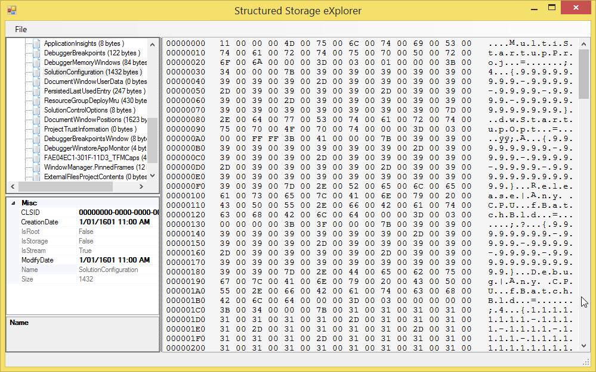

## The nuget package 

https://nuget.org/packages/SetStartupProjects/

    PM> Install-Package SetStartupProjects

## Justification

At [Particular](http://particular.net/), as part of our [documentation site](http://docs.particular.net/), we **manipulate Visual Studio .suo files** to allow us to control the start-up projects of our [downloadable samples](http://docs.particular.net/samples/). 

Many of our samples have multiple "startable" components, eg services and websites that interact. To run correctly all these components have to run when the solution is "started". The default behavior of Visual Studio is to "set the first project in the solution as the start project". This is problematic since it results in several friction points:

* Multiple start-up projects need to be documented, taking up space better used for the sample description.
* People who download samples need manually setting the start-up projects.

Often people forget to set start-up projects and one of two things happen:

1. If a Class Library is first Visual Studio gives a warning about "A Class Library cannot be started directly"
2. If startable project is first it will start, but fails to start the other projects in the solution, resulting in the sample failing to run as expected.  

### Why not commit the SUO to source control

The start-up projects for a solution are stored in the [Solution User Options (.Suo) File](https://msdn.microsoft.com/en-us/library/bb165909.aspx). It is possible to modify the start-up projects, save the solution (and hence `.suo`), and the commit that `.suo` to source control. The problem is that the `.suo` stores many other user preferences and, since it is binary, it is not possible to "only commit the start-up projects". This  adds friction to the people maintain the samples since they need to be very careful about changes to the `.suo` and the effect those changes have on downstream consumers.

## Surely this is a solved problem 

Visual Studio was released in 1995 and with it the concept of an `.suo` configuration file. Generally when a technology has been around for 20 years most of the problems are solved. If not there are enough nuggets of information around to piece together a solution. This does not seem to be the case for setting start project using code. There are several other approaches which do not match our requirements: 

* **Manipulate the order of projects in a solution**: The [Sln Startup Project](https://github.com/michaKFromParis/slnStartupProject) can change the start-up projects by leveraging the side effect of Visual Studio starting the first project. It works by reordering the projects in the `.sln` file. However this approach only works for a single start-up project.
* **Switch from within Visual Studio**: The [switchstartupproject](https://bitbucket.org/thirteen/switchstartupproject/wiki/Home) is a Visual Studio extension that supports multiple combinations of startup projects. Very useful but not an option since the context of this problem is not inside Visual Studio.

## The underlying format of an suo 

A `.suo` is actually a "OLE Compound Document File" which seems to be synonymous with the [Microsoft Compound File Binary File (MCDF) Format](https://msdn.microsoft.com/en-us/library/dd942138.aspx). This is the same format used by previous generation Office documents (`.doc`, `.xls`, `.ppt`).

## OpenMCDF

This project uses [Open MCDF](http://openmcdf.sourceforge.net/) ([nuget](https://www.nuget.org/packages/OpenMcdf/)) to manipulate the underlying binary structure of the `.suo`. 

> OpenMCDF is a 100% managed .net component that allows client applications to manipulate COM structured storage files, also known as Microsoft Compound Document Format files.

OpenMCDF ships with a sample Windows Forms application, for browsing and editing files, named "Structured Storage Explorer".

## The underlying suo structure

MCDF files have the concept of streams and, in an .suo file, the stream named `SolutionConfiguration` contains the start-up projects. 

To view this structure taking a sample solution with 3 projects and hack the project GUIDs to make it easier to debug

 * `ClassLibrary` GUID=`99999999-9999-9999-9999-999999999999`
 * `ConsoleApplication1` GUID=`11111111-1111-1111-1111-111111111111`
 * `ConsoleApplication2` GUID=`22222222-2222-2222-2222-222222222222`

Set the start-up projects to be `ConsoleApplication1` and `ConsoleApplication2`.

Opening the `.suo` for this solution in Structured Storage Explorer and navigating to the `SolutionConfiguration` Stream will show

You will note the text contains the project GUIDs mentioned above. 

## The Encoding of the `SolutionConfiguration` Stream 

Note that the "Structured Storage Explorer" has trouble decoding the binary value of the stream. This is due it making an incorrect assumption on the encoding.

The encoding of the `SolutionConfiguration` Stream is Utf16, although this was only discovered by attempting multiple different encodings. Also from looking at other streams the choice of encoding does not seem to be consistent across all streams. You can read the value of the `SolutionConfiguration` Stream using the OpenMCDF library as follows:

    var utf16 = Encoding.GetEncodings()
        .Single(x => x.Name == "utf-16")
        .GetEncoding();
    using (var solutionStream = File.OpenRead(suoPath))
    using (var compoundFile = new CompoundFile(solutionStream, UpdateMode.ReadOnly, true, true, false))
    {
        var configStream = compoundFile.RootStorage.GetStream("SolutionConfiguration");
        var bytes = configStream.GetData();
        Debug.WriteLine(utf16.GetString(bytes));
    }    
 
Which gives us this

    MultiStartupProj = ;4 {99999999-9999-9999-9999-999999999999}...

Note that Visual Studio has trouble rendering the characters. If you instead save the contents to a text file. 

    using (var solutionStream = File.OpenRead(suoPath))
    using (var compoundFile = new CompoundFile(solutionStream, UpdateMode.ReadOnly, true, true, false))
    {
        var configStream = compoundFile.RootStorage.GetStream("SolutionConfiguration");
        var bytes = configStream.GetData();

        var utf16 = Encoding.GetEncodings()
            .Single(x => x.Name == "utf-16")
            .GetEncoding();
        File.WriteAllText("temp.txt", utf16.GetString(bytes), utf16);
    }

Opening `temp.txt` in [Sublime Text](http://www.sublimetext.com/) will reveal this (new lines added after `;` characters for clarity)

Note the existence of [control characters](http://en.wikipedia.org/wiki/Control_character#In_ASCII) explains why both the MCDF explorer and Visual Studio had trouble rendering them.

## Dissecting the contents

There are several other settings stored in the configuration stream. The important parts related to enabling multiple start projects are as follows:

### The key indicating the start of the multiple startup section:

### Defining each project that should be part of the multiple start:

### Redundant information

The rest are configuration options and [miscellaneous project files](https://msdn.microsoft.com/en-us/library/bb166496.aspx) that Visual Studio would usually default to when there is no `.suo`. 

## Minimum settings to write back

For the sample solutions project GUIDs the minimum that needs to be written back to that stream is:

## The suo templated used

As to include minimum baggage (extra `.suo` settings) this project uses a template '.suo' taken from an empty project. This was created using a new empty solution with no projects and save the solution to produce an, almost empty, `.suo` file `SampleSolution.v12.suo`. Note that in this use case **the target `.suo` is replaced and not modified**.

## The MultiStartupProj writing code

The underlying code to write the startup GUIDs to the `.suo` is as follows:

    static void SetSolutionConfigValue(CFStream cfStream, IEnumerable<string> startupProjectGuids)
    {
        var single = Encoding.GetEncodings().Single(x => x.Name == "utf-16");
        var encoding = single.GetEncoding();
        var NUL = '\u0000';
        var DC1 = '\u0011';
        var ETX = '\u0003';
        var SOH = '\u0001';

        var builder = new StringBuilder();
        builder.Append(DC1);
        builder.Append(NUL);
        builder.Append("MultiStartupProj");
        builder.Append(NUL);
        builder.Append('=');
        builder.Append(ETX);
        builder.Append(SOH);
        builder.Append(NUL);
        builder.Append(';');
        foreach (var startupProjectGuid in startupProjectGuids)
        {
            builder.Append('4');
            builder.Append(NUL);
            builder.AppendFormat("{{{0}}}.dwStartupOpt", startupProjectGuid);
            builder.Append(NUL);
            builder.Append('=');
            builder.Append(ETX);
            builder.Append(DC1);
            builder.Append(NUL);
            builder.Append(';');
        }

        var newBytes = encoding.GetBytes(builder.ToString());
        cfStream.SetData(newBytes);
    }

## Using the library on the Sample Solution

Using the SetStartupProjects nuget the startup projects for the Sample Solution can be written back using the following:

    var startupProjectGuids =new List<string>
    {
        "11111111-1111-1111-1111-111111111111",
        "22222222-2222-2222-2222-222222222222"
    };
    var startProjectSuoCreator = new StartProjectSuoCreator();
    startProjectSuoCreator.CreateForSolutionDirectory(solutionDirectory, startupProjectGuids);

## Verifying the results

Opening the Sample Solution you will note the startup projects have been changed.

## How to determine start projects

Determining the startup projects for a solution can be derived using a combination the the `.csproj` content, some xml querying, and a [lookup list of projects that can be considered startable](http://www.mztools.com/articles/2008/mz2008017.aspx). This is encapsulating in the `StartProjectFinder` class.

    var startupProjectGuids = new StartProjectFinder()
        .GetStartProjects(solutionDirectory)
        .ToList();
    var startProjectSuoCreator = new StartProjectSuoCreator();
    startProjectSuoCreator.CreateForSolutionDirectory(solutionDirectory, startupProjectGuids);

You can, of course, write your own logic for determining startup project GUIDs and pass them to `StartProjectSuoCreator`. 

## Multiple versions of Visual Studio
  
`StartProjectSuoCreator` writes `.suo` files for Visual Studio 2012, 2013 and 2015. 

## Icon 

<a href="https://thenounproject.com/term/equestrian/56632/" target="_blank">Helmet</a> designed by <a href="https://thenounproject.com/gwyn751%40gmail.com/" target="_blank">Gwyn Lewis</a> from The Noun Project.